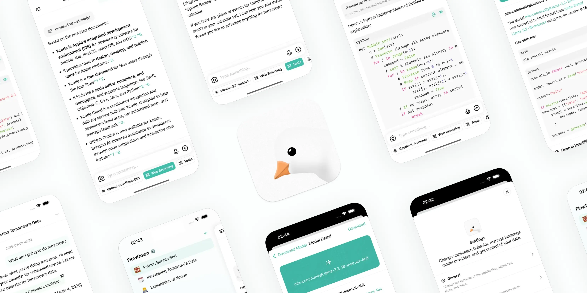

# 浮望

  <a href="../../../README.md">English</a> |
  <a href="/Resources/i18n/zh-Hans/README.md">简体中文</a>

浮望（FlowDown）是一款能跟上你思维节奏的 AI/LLM 客户端应用程序。同时提供全链路隐私保护。

## 下载

或通过 `brew install --cask flowdown` 安装（由第三方维护）

或 [TestFlight](https://testflight.apple.com/join/StpMeybv) 参与测试版体验。测试版随时可能过期，请勿用于生产环境。

当你从 App Store 下载我们的软件时，浮望内置免费的对话模型。关于使用上的具体事项，请考虑查看文档：[https://apps.qaq.wiki/docs/flowdown/zh/](https://apps.qaq.wiki/docs/flowdown/zh/)

请考虑加入我们的聊天：[Discord](https://discord.gg/UHKMRyJcgc)。

如需生成企业模型配置（即自定义 API 调用），可使用第三方网站：[https://flowdown-model.vercel.app/](https://flowdown-model.vercel.app/)。我们不对该网站生成的内容负责，请自行甄别风险。

## 功能

- [x] **轻量级和高效** 紧凑的设计，实现无缝性能
- [x] **Markdown 支持** 响应中支持富文本格式
- [x] **通用兼容性** 支持所有 OpenAI 兼容的服务提供商
- [x] **极速文本渲染** 提供无缝的用户体验
- [x] **自动聊天标题** 简化对话，提高生产力
- [x] **自动对话模板** 利用 LLM 总结请求生成对话模板，便于复用
- [x] **隐私优先** 我们不收集您的数据
- [x] **完全开源** 你可以亲自验证我们的承诺

## 版本对比

我们提供两种版本的 FlowDown：**FlowDown** 和 **FlowDown Community**。Community 版已弃用。

| **功能**        | **FlowDown**                                                                                  | **FlowDown Community** |
| --------------- | --------------------------------------------------------------------------------------------- | ---------------------- |
| 与 AI 聊天      | ✅                                                                                            | ✅                     |
| 极速 Markdown   | ✅                                                                                            | ✅                     |
| 隐私优先        | ✅                                                                                            | ✅                     |
| 自定义 LLM      | ✅ [指南](https://apps.qaq.wiki/docs/flowdown/zh/documents/advanced_settings/enterprise.html) | ✅                     |
| 离线 LLM（MLX） | ✅ [列表](https://apps.qaq.wiki/docs/flowdown/zh/documents/quickstart/local_models.html)      | ❌                     |
| 视觉 LLM        | ✅                                                                                            | ❌                     |
| 开源            | ✅ _终于_                                                                                     | ✅                     |
| 网络搜索        | ✅                                                                                            | ❌                     |
| 附件            | ✅                                                                                            | ❌                     |
| 语言本地化      | ✅                                                                                            | ❌                     |

## 许可证

FlowDown 主程序基于 AGPL-3.0 许可证，绝大多数解耦库组件基于 MIT 许可证。完整许可证请见 [LICENSE](../../../LICENSE) 文件或各依赖库内。

FlowDown Community 基于 MIT 许可证。完整许可证请见 [LICENSE](../../../Resources/CommunityEdition/LICENSE) 文件。

图标和艺术资源不以任何形式再授权使用。商业许可证的使用情况请与我们联系。

---

© 2025 FlowDown 团队 (@Lakr233) 保留所有权利。
