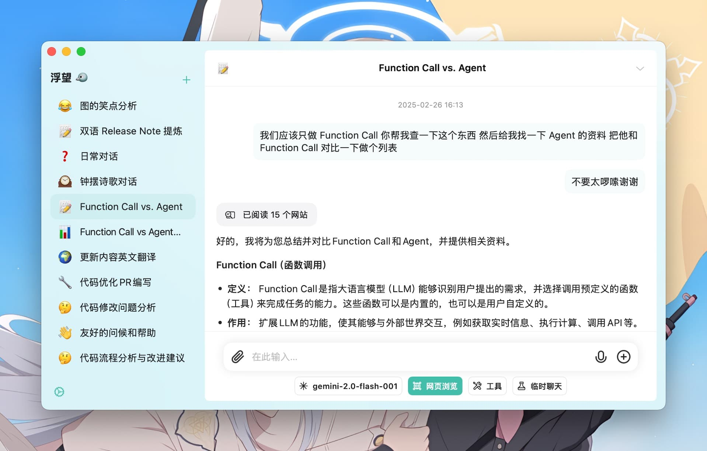

# 浮望

浮望（FlowDown）是一个速度极快、平滑的 AI/LLM 客户端应用程序。

## 访问文档

当你从 App Store 下载我们的软件时，浮望内置免费的对话模型。关于使用上的具体事项，请考虑查看文档：[https://apps.qaq.wiki/docs/flowdown/zh/](https://apps.qaq.wiki/docs/flowdown/zh/)

## 保持联系

请考虑加入我们的聊天：[Discord](https://discord.gg/UHKMRyJcgc)。

## 预览

## 功能

- [x] **轻量级和高效** 紧凑的设计，实现无缝性能
- [x] **Markdown 支持** 响应中支持富文本格式
- [x] **通用兼容性** 支持所有 OpenAI 兼容的服务提供商
- [x] **极速文本渲染** 提供无缝的用户体验
- [x] **自动聊天标题** 简化对话，提高生产力
- [x] **设计中的隐私** 我们不收集您的数据

## 版本对比

我们提供两种版本的 FlowDown：**FlowDown** 和 **FlowDown Community**。

| **功能** | **FlowDown** | **FlowDown Community** |
| -------- | ---------------- | ---------------------- |
| 只能聊天 | ✅               | ✅                     |
| 高速渲染 | ✅               | ✅                     |
| 自建模型 | ✅               | ✅                     |
| 离线模型 | ✅ (使用 mlx)     | ❌                     |
| 视觉模型 | ✅               | ❌                     |
| 隐私保护 | ✅               | ✅                     |
| 开放代码 | ❌               | ✅                     |
| 网络搜索 | ✅               | ❌                     |
| 添加附件 | ✅               | ❌                     |
| 本地语言 | ✅               | ❌                     |

**开源声明**

**FlowDown Community** 将很快开源，其源代码将在官方版本发布后短时间内在此存储库中公开。通过共享我们的代码，我们希望开发人员构建更具交互性和响应性的 AI 客户端应用程序。

## 开始使用

### 系统要求

- iOS 16.0 或更高版本
- macOS 13.0 或更高版本

### 安装

请参阅 [发布](https://github.com/Lakr233/FlowDown-Beta/releases) 以获取详细信息。

## 许可证

- **FlowDown** 是专有软件。保留所有权利。
- **FlowDown Community** 根据 [MIT](../../../LICENSE) 许可证开放。

---

© 2025 FlowDown 团队 (@Lakr233, @ktiays, @unixzii) 保留所有权利。
